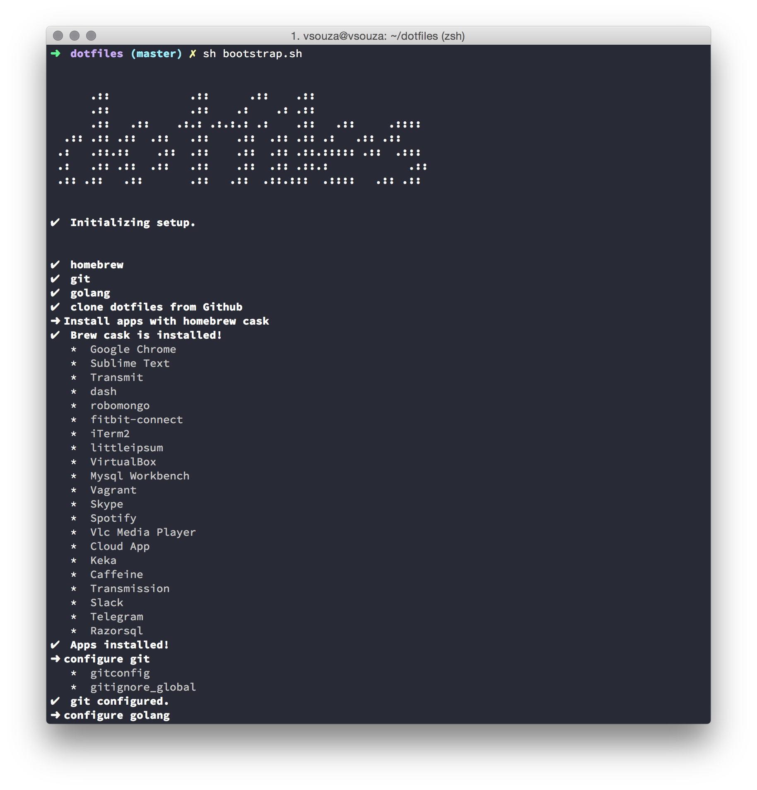

# dotfiles



My Mac Settings and includes quite a select list of apps installed automatically

__vim__

My setup came from this [repo](https://github.com/vsouza/.vimrc), if you wanna just vim setup, feel free to clone and 
contribute. 

__golang__

Golang setup in MacOSX it's very simple, check this [gist](https://gist.github.com/vsouza/77e6b20520d07652ed7d)

__osx__

I have some customizations on my osx enviroment. Like a time for show and hide dock e etc.

__apps__

Homebrew-cask is a nice project, i've added some apps to my bootstrap setup. If you want to add more, check this:
[Homebrew-cask website](http://caskroom.io/)

__python__

Ipdb and virtualenvwrapper it is included on this project.


## Install

__Make sure that you already have installed xcode !__

```sh
$ curl -L https://raw.github.com/vsouza/dotfiles/master/bootstrap.sh | sh
```

This will clone this repository and symlink the appropriate files in `~/dotfiles` to your home directory.

## What's included?

All my command-line tools and its configurations. Have fun :)

#### Apps

* Google Chrome
* Sublime Text
* Transmit
* dash
* robomongo
* fitbit-connect
* iTerm2
* littleipsum
* VirtualBox
* Mysql Workbench
* Vagrant
* Skype
* Spotify
* Vlc Media Player
* Cloud App
* Keka
* Caffeine
* Transmission
* Slack
* Telegram
* Razorsql


#### Shell

* [ZSH](http://www.zsh.org/) for shell
* [Oh my ZSH](https://github.com/robbyrussell/oh-my-zsh) for ZSH tweaking

##### Theme

* [Dracula](https://github.com/zenorocha/dracula-theme) by [@zenorocha](https://github.com/zenorocha)

#### General

* [Homebrew](http://mxcl.github.com/homebrew/) for MacOS X package management
* [Homebrew Cask](http://caskroom.io/) to install apps easily
* [Golang](http://golang.org) Google's language
* [Git](http://git-scm.com) for code versioning

#### .osx Configuration

Thanks to [brandonb927](https://gist.github.com/brandonb927/3195465) for this great hack.

## Credits

* This project is a customized version of: [@zenorocha old-dotfiles](https://github.com/zenorocha/old-dotfiles)

## License

[MIT License](http://vsouza.mit-license.org/) © Vinicius Souza